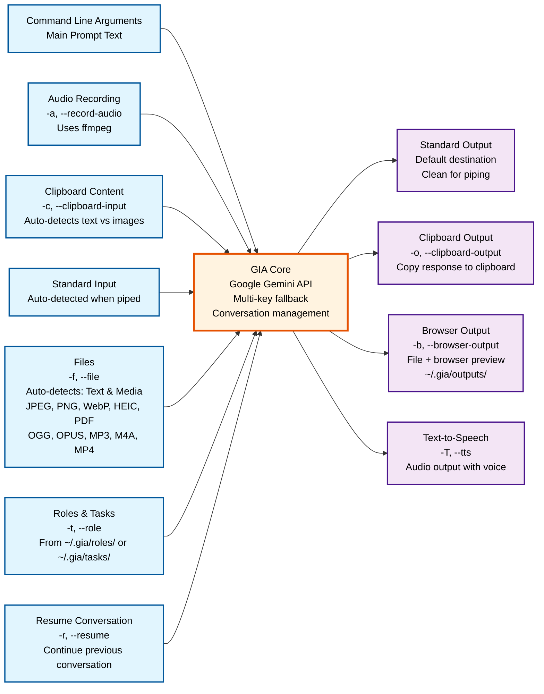

# GIA Input/Output Flow Diagram

This diagram visualizes all the different input sources and output destinations available in the GIA (Google Intelligence Assistant) tool.



## Input Sources

1. **Command Line Arguments** - Main prompt text (required, except audio-only)
2. **Audio Recording** (-a) - Record audio using ffmpeg, auto-generates prompt
3. **Clipboard Content** (-c) - Auto-detects text vs images
4. **Standard Input** - Automatically detected when piped
5. **Files** (-f) - Auto-detects text and media files (images, audio, video, PDFs)
6. **Roles & Tasks** (-t) - Load AI personas and instructions from markdown files
7. **Resume Conversation** (-r) - Continue previous conversations with context

## Output Destinations

1. **Standard Output** - Default, clean output suitable for piping
2. **Clipboard Output** (-o) - Copy response directly to clipboard
3. **Browser Output** (-b) - Save to file and open browser preview
4. **Text-to-Speech** (-T) - Audio output with configurable voice

## Key Features

- **Multi-source Input**: Combine multiple input sources in a single command
- **Intelligent Processing**: Auto-detection of input types and formats
- **Flexible Output**: Choose how and where to receive responses
- **Conversation Persistence**: Automatic conversation saving and resumption
- **Fallback Support**: Multi-API key support with automatic rate limit handling
- **Cross-platform**: Works on Windows, macOS, and Linux

## Example Combinations

```bash
# Multiple inputs to clipboard output
gia "Analyze this code and documentation" -f README.md -f main.rs -f diagram.png -o

# Audio + text with browser preview
gia -a "Also consider this context" -c -b

# Resume conversation with file input
gia --resume "Continue with this new data" -f data.csv

# Role-based analysis with multiple sources
gia -t code-review "Review this implementation" -f src/ -f architecture.png

# Generate conventional commit message from git diff
git diff --cached | gia 'Generate conventional commit message. Use Emojis in subject (Gitmoji). Do NOT explain your Procedure.'

# Transcribe directly recorded audio to text
gia -t transkribiere -ao

# Translate text in the clipboard to English
gia -c translate to english -o
```
